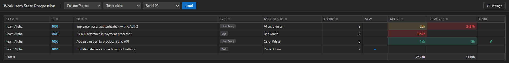
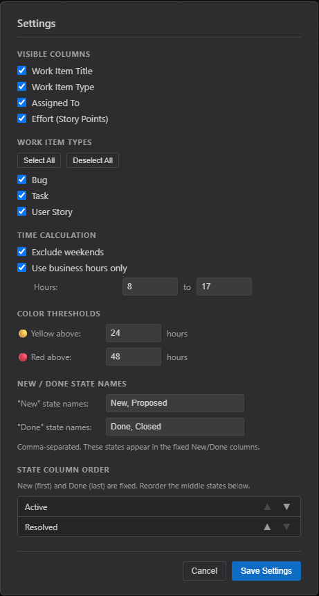

# Work Item State Progression

An Azure DevOps extension that adds a **State Progression** hub to the Boards section. It shows how long each work item spent in every workflow state during a sprint, helping leadership identify bottlenecks.

---

## Features

### Sprint Selector

Choose a **project**, **team**, and **sprint** from the dropdowns at the top of the hub, then click **Load**. The extension fetches every work item in that sprint and calculates how many hours each one spent in each state.

### State Duration Table

Results appear in a table where columns are the work item's workflow states and each cell shows the time spent in that state:

| Column | Description |
|---|---|
| **Team** | The team the work item belongs to |
| **ID** | Work item ID — click to open the work item in a new tab |
| **Title** | Work item title (show/hide in Settings) |
| **Type** | Work item type — Story, Bug, Task, etc. (show/hide in Settings) |
| **Assigned To** | Person the work item is assigned to (show/hide in Settings) |
| **Effort** | Story points / effort estimate (show/hide in Settings) |
| **New** | Bullet indicator (●) if the item is currently in a New state; no hours calculated |
| **[Middle states]** | Hours spent in each intermediate state, color-coded by threshold |
| **Done** | Checkmark (✔) if the item has reached a Done state; no hours calculated |

A **Totals** row at the bottom sums the hours for each middle-state column across all visible rows.

All columns except **New** and **Done** are sortable.



### Color Coding

Each middle-state cell is color-coded based on configurable hour thresholds:

| Color | Meaning |
|---|---|
| No color | Zero hours — work item never entered this state |
| Green | Hours are below the yellow threshold |
| Yellow | Hours are at or above the yellow threshold but below the red threshold |
| Red | Hours are at or above the red threshold — likely a bottleneck |

### Settings

Click **⚙ Settings** in the toolbar to configure the extension:

**Visible Columns** — show or hide Title, Work Item Type, Assigned To, and Effort.

**Work Item Types** — check or uncheck specific work item types (Story, Bug, Task, etc.) to filter which rows appear in the table. **Select All** / **Deselect All** shortcuts are provided. Newly discovered types always default to visible.

**Time Calculation**
- *Exclude weekends* — weekend hours are not counted toward any state duration.
- *Use business hours only* — only hours within a configurable start/end window (default 08:00–17:00) are counted each day.

**Color Thresholds** — set the number of hours at which a cell turns yellow and red.

**New / Done State Names** — comma-separated list of state names that map to the fixed New (first) and Done (last) columns. Defaults are `New, Proposed` for New and `Done, Closed` for Done. Adjust these if your process uses different names.

**State Column Order** — reorder the middle state columns using the ▲ / ▼ buttons. New and Done columns are always fixed at the first and last positions. Newly discovered states are appended to the right and can be reordered here.

Settings are persisted in the Azure DevOps Extension Data Service and survive page refreshes.



---

## Local Development

### Prerequisites

```
node >= 18
npm >= 9
```

Install dependencies once:

```bash
npm install
```

### Run with Mock Data (F5 in VS Code)

The project ships with a local mock that replaces the Azure DevOps SDK and API with realistic stub data, so you can develop without a live organization.

Press **F5** in VS Code (or run `npm run dev` in a terminal). The extension opens automatically at `http://localhost:3000/hub/hub.html`.

The mock includes:

- **2 projects** (`FulcrumProject`, `PlatformServices`)
- **3 teams** (`Team Alpha`, `Team Beta`, `Platform Core`)
- **Sprint 23** with 7 work items across the teams — a mix of User Stories, Bugs, and Tasks in various states
- Work item state histories with realistic timestamps, including a bottleneck item (ID 1005) that has been Active since the first day of the sprint
- In-memory extension data storage so settings save and load correctly during a dev session

To start the dev server manually:

```bash
npm run dev          # kills any process on port 3000, then starts webpack-dev-server with mock data
npm start            # equivalent, without the port-kill step
```

### Build

```bash
npm run build        # production build → dist/
npm run watch        # development build, rebuild on file change
```

---

## Publishing to the Marketplace

### Prerequisites

**1. Visual Studio Marketplace publisher account**

Create a publisher at [https://marketplace.visualstudio.com/manage](https://marketplace.visualstudio.com/manage). The publisher ID in `vss-extension.json` is `ScottRupke` — this must match your registered publisher ID exactly.

**2. Personal Access Token (PAT)**

In Azure DevOps, create a PAT with the following scope:

- Organization: **All accessible organizations**
- Scope: **Marketplace → Publish**

Copy the token; you will pass it to `tfx` at publish time.

**3. tfx-cli** is already included as a dev dependency (`npm run package` and `npm run publish` use it via `npx`).

---

### Publish as Private (organization-only)

A private extension is only visible to organizations you explicitly share it with. This is the default (`"public": false` in `vss-extension.json`).

**Step 1 — Build and package**

```bash
npm run package
```

This runs webpack followed by `tfx extension create`, producing a `.vsix` file (e.g. `ScottRupke.fulcrum-work-item-state-progression-1.0.0.vsix`).

**Step 2 — Publish**

```bash
npx tfx extension publish \
  --manifest-globs vss-extension.json \
  --token <your-PAT>
```

Or using the npm script (you will be prompted for the PAT interactively):

```bash
npm run publish
```

**Step 3 — Share with your organization**

After publishing, the extension is visible only to you. Share it with your Azure DevOps organization from the Marketplace publisher portal, or via CLI:

```bash
npx tfx extension share \
  --publisher ScottRupke \
  --extension-id fulcrum-work-item-state-progression \
  --share-with my-org \
  --token <your-PAT>
```

**Step 4 — Install in the organization**

In the target Azure DevOps organization, go to **Organization Settings → Extensions → Shared** and click **Install** next to the extension.

---

### Publish as Public (available to everyone)

> Public extensions are visible on the Marketplace to any Azure DevOps user. Ensure the extension is production-ready before making it public.

**Step 1 — Set `public: true`**

Edit `vss-extension.json`:

```json
"public": true,
```

**Step 2 — Verify the publisher is verified**

Microsoft requires a verified publisher for public extensions. Submit your publisher for verification at [https://marketplace.visualstudio.com/manage/publishers](https://marketplace.visualstudio.com/manage/publishers). Verification is a manual review process that can take a few days.

**Step 3 — Package and publish**

```bash
npm run package
npx tfx extension publish \
  --manifest-globs vss-extension.json \
  --token <your-PAT>
```

The extension will appear on the public Marketplace after passing Microsoft's automated content scan (usually within minutes for updates, longer for a first-time public publish).

---

### Updating an Existing Extension

Increment the `version` field in `vss-extension.json` (semver), then publish again:

```bash
npm run publish
```

`tfx` will update the existing listing in place. Installed instances in all organizations will be updated automatically by Azure DevOps.

---

### Scopes

The extension declares the `vso.work` scope, which grants read-only access to work items, work item history, teams, iterations, and sprint data. No write scope is requested or used.

---

## Project Structure

```
src/
  hub/
    hub.tsx       # Main React component — all UI and API logic
    hub.scss      # Component styles (CSS custom properties for ADO theming)
    hub.html      # Entry HTML page
  mocks/
    sdk.ts                         # Mock Azure DevOps Extension SDK (includes getService / data store)
    api.ts                         # Mock getClient() — routes to the appropriate mock client
    core-client.ts                 # Stub data: projects and teams
    work-client.ts                 # Stub data: sprints and sprint work item IDs
    work-item-tracking-client.ts   # Stub data: work item fields and state transition histories
scripts/
  dev-start.js   # Kills port 3000, then starts webpack-dev-server
vss-extension.json  # Extension manifest
webpack.config.js   # Webpack 5 config; --env mock enables stub aliases
```

## Tech Stack

| | |
|---|---|
| Framework | React 16 (required by azure-devops-ui v2) |
| ADO SDK | azure-devops-extension-sdk v4 |
| ADO API | azure-devops-extension-api v4 (`Core`, `Work`, `WorkItemTracking`) |
| Bundler | Webpack 5 |
| Language | TypeScript 5 |
